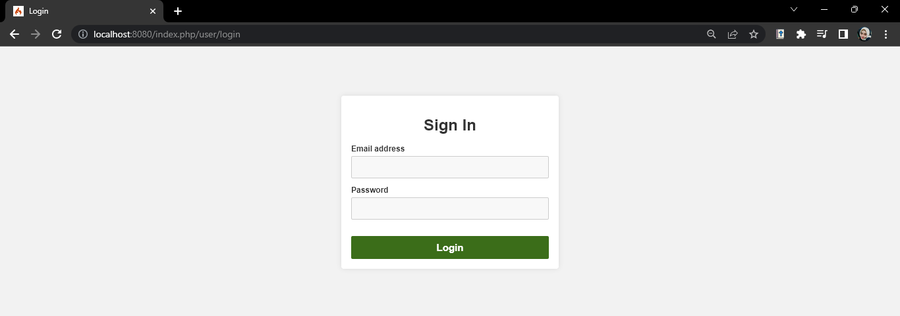
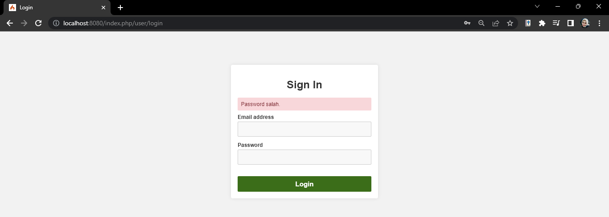

# Lab9Web

### Membuat PHP Frame Work (Codeigniter) Lanjutan <b>
Ini merupakan lanjutan fremework dengan menambahkan modul login. Berikut untuk membuat tabel user pada database
```
CREATE TABLE user (
id INT(11) auto_increment,
username VARCHAR(200) NOT NULL,
useremail VARCHAR(200),
userpassword VARCHAR(200),
PRIMARY KEY(id)
);
```

## Berikut output from login


> apabila kita salah memasukan password maka akan muncul seperti dibawah ini

